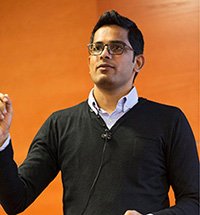

# Highlighted Sessions from jsMobileConf

Back in October, [Progress](https://www.progress.com/) put on a brand new event in Boston focused on mobile JavaScript and the broader JavaScript ecosystem. Called [jsMobileConf](https://jsmobileconf.com/), this conference brought in speakers from Microsoft, Adobe, Google, and Progress to talk about topics such as serverless, IoT, native apps, AR/VR, mobile web, AI, and more.

Admittedly we've been a bit tardy in getting videos of the conference ready for you all, but here is a selection of some of the most highly-rated talks from jsMobileConf 2018 (and the full playlist is [available on YouTube](https://www.youtube.com/playlist?list=PLC679RvCan2BecETAjIhyIk2tRN6AYKM6))!

> **NOTE:** jsMobileConf is coming back to Boston later this year! Stay tuned to (soon-to-be-updated) [jsMobileConf.com](https://jsmobileconf.com/) for more details.

### [Tejas Ranade](https://twitter.com/tejasrnd): Building Rich Offline Applications [[slides](https://github.com/rdlauer/jsmobileconf-2018-speakers/blob/master/Ranade%20-%20Building%20Offline%20Apps.key?raw=true)]

*IndexedDb, WebSQL, local storage, SQLite, Service Workers… what to choose and when. In this talk, we’ll discuss the options available to the JS developer for designing rich, seamless offline experiences.*

<iframe width="560" height="315" src="https://www.youtube.com/embed/4PsI9Dal9no" frameborder="0" allow="accelerometer; autoplay; encrypted-media; gyroscope; picture-in-picture" allowfullscreen></iframe>

### [Tara Manicsic](https://twitter.com/Tzmanics): Everything You Need To Node

*Do you know Node? You’ve probably heard of or even used Node but do you know all the things you can do with Node? You may have heard Node described as JavaScript for the back-end. Although you can create back-end applications it’s not exclusively used to develop back-end apps. Since Node is a JavaScript runtime it allows you to execute JavaScript in a computing environment rather than a browser environment. Oh the possibilities! In this session we’ll walk through a number of different types of projects you can build using Node. Hopefully unveiling some things you didn’t even know you could Node. Finally, we’ll code a Node application of our own, step-by-step. Looking forward to coding with you!*

<iframe width="560" height="315" src="https://www.youtube.com/embed/8Pwq-_jpsTc" frameborder="0" allow="accelerometer; autoplay; encrypted-media; gyroscope; picture-in-picture" allowfullscreen></iframe>

### [Simon MacDonald](https://twitter.com/macdonst): The FaaS and the Serverless [[slides](https://slides.com/simonmacdonald/the-faas-and-the-serverless-39)]

*Did you ever notice that FasS & Serverless is a lot like the Fast & the Furious series of movies? Each of the different characters is like a function specializing in doing one thing really well. Then when when you combine their abilities as a team they can accomplish anything like a great app.*

<iframe width="560" height="315" src="https://www.youtube.com/embed/_owPLNvymjo" frameborder="0" allow="accelerometer; autoplay; encrypted-media; gyroscope; picture-in-picture" allowfullscreen></iframe>

### [Nischal Reddy](https://twitter.com/nischalsrinivas): Micro Apps - Breaking the Mobile App Monolith and Delivering Omnichannel Experiences [[slides](https://github.com/rdlauer/jsmobileconf-2018-speakers/blob/master/Reddy%20-%20Microapps.pptx?raw=true)]

*We have long been breaking monoliths to create microservices that are atomic, independent and decoupled. But for the most part the mobile app UI is still a huge monolith that consumes all the microservices, which makes it hard to maintain, comes with high cost of change that causes development costs to soar. These problems are leading to long release cycles and eventually abandoning apps in production. The solution is to decompose a mobile monolith to an ecosystem of Microapps!. Microapps are single purpose, cross platform apps that are designed to support a single step in a users workflow. Microapps helps in delivering a constant stream of incremental updates without long app release cycle, they help deliver a consistent user experience across different user touchpoints (be it mobile, web or wearables). Come attend this session to find out how Microapps architecture can help your development team accelerate pace of change while enabling them to deliver value in parallel.*

<iframe width="560" height="315" src="https://www.youtube.com/embed/kFNNi1AQgmA" frameborder="0" allow="accelerometer; autoplay; encrypted-media; gyroscope; picture-in-picture" allowfullscreen></iframe>

### [Sage Franch](https://twitter.com/theTrendyTechie): Blockchain Crash Course [[slides](https://github.com/rdlauer/jsmobileconf-2018-speakers/blob/master/Franch%20-%20Blockchain.pptx?raw=true)]

*Decentralization, blockchain, ICO - let’s go beyond the buzzwords and understand the meaning of the movement. We’ll explore blockchain in simple terms, look at the current ecosystem of decentralization tools, and walk through a simple blockchain application built with JS and Solidity.*

<iframe width="560" height="315" src="https://www.youtube.com/embed/L5w7UDD02LM" frameborder="0" allow="accelerometer; autoplay; encrypted-media; gyroscope; picture-in-picture" allowfullscreen></iframe>

### [Brandon Satrom](https://twitter.com/BrandonSatrom): Bending the IoT to Your Will with JavaScript [[slides](https://github.com/rdlauer/jsmobileconf-2018-speakers/raw/master/Satrom%20-%20IoT.pdf)]

*In 2018, connected, embedded systems are everywhere, and “the IoT” is quickly moving beyond the connected-toaster memes of recent years and into the realm of reality. And as more and more developers are solving real problems with IoT devices, they are discovering that building an IoT solution is about more than a microcontroller, sensors, actuators and a Wi-Fi or cellular radio. It’s also about how that device interfaces with the world around it, makes its data available, and allows itself to be controlled from the cloud. Ultimately, building IoT solutions is about building applications that leverage hardware, firmware, and software, and savvy developers are discovering that, in the software realm, JavaScript plays a heavy role in enabling connected applications. In this session, we’ll explore some of the ways that the modern developer can take control of the IoT with JavaScript.*

<iframe width="560" height="315" src="https://www.youtube.com/embed/aeLsgyWbjTc" frameborder="0" allow="accelerometer; autoplay; encrypted-media; gyroscope; picture-in-picture" allowfullscreen></iframe>

### [Sebastian Witalec](https://twitter.com/sebawita): Adopt an AI-driven Chatbot Today [[slides](https://github.com/rdlauer/jsmobileconf-2018-speakers/blob/master/Witalec%20-%20Chat%20Bots.key?raw=true)]

*If you ever asked yourself any of these questions: What do chatbots eat? Do chatbots have dreams? What are the usual chatbot challenges? Then this talk is for you. We will answer all of the above questions and many more. You will learn how to build a fully functioning chatbot in less than 10 minutes – without a single IF statement – and train it to understand human language. Then we will top it up with a quick AI training to make it understand the language normal people speak.*

<iframe width="560" height="315" src="https://www.youtube.com/embed/ekBsnEQjreg" frameborder="0" allow="accelerometer; autoplay; encrypted-media; gyroscope; picture-in-picture" allowfullscreen></iframe>

### [Amal Hussein](https://twitter.com/nomadtechie): Machine Powered Refactoring

*Web apps are evolving targets which show their age via varying degrees of code cruft. And that’s ok. Tech debt is an expected side-effect of living production web apps, and the challenge lies in paying down the debt while still pushing forward. Enter Abstract Syntax Trees… ASTs enable developers to parse input code into a predictable tree data structure that can be easily traversed, manipulated and then regenerated in place. Transpilers such as BabelJS use this powerful pattern to transpile ES2015+ down to a baseline of ES5. While this 1:1 transpiling is the most common usage of ASTs, they can also be leveraged to supercharge the transformation of your legacy code to meet the conventions, libraries, and/or design patterns your team is using today. Amal aims to demystify this process by breaking down the steps of how to build your own custom AST based transforms. Happy Traversing!*

<iframe width="560" height="315" src="https://www.youtube.com/embed/FR-4kVpizSY" frameborder="0" allow="accelerometer; autoplay; encrypted-media; gyroscope; picture-in-picture" allowfullscreen></iframe>

### [Anton Hristov](https://twitter.com/AntonHristov): Building an Innovation Engine Inside Your Organization [[slides](https://github.com/rdlauer/jsmobileconf-2018-speakers/raw/master/Hristov%20-%20Building%20Innovation%20Engine.pdf)]

*The pace of technological advancement is accelerating and so is the rate of user adoption which creates an amazing market opportunity and a daunting challenge for existing businesses that want to remain at the cutting edge of technology and grow. Let’s explore how organizations can take advantage of this opportunity by creating a culture of learning, applying the scientific method to idea validation and helping entrepreneurial employees bring ideas to life – from launching a MVP (minimum valuable product) to achieving product-market fit and measuring success along the way. We will look at Progress Labs as a case in point.*

<iframe width="560" height="315" src="https://www.youtube.com/embed/qWp31VPpilU" frameborder="0" allow="accelerometer; autoplay; encrypted-media; gyroscope; picture-in-picture" allowfullscreen></iframe>

### Panel Discussion: The Future of Mobile

*A panel discussion of where mobile is headed, including conversations on virtual/augmented reality, AI, machine learning, IoT, and more.*

<iframe width="560" height="315" src="https://www.youtube.com/embed/s5ip_oiBWMA" frameborder="0" allow="accelerometer; autoplay; encrypted-media; gyroscope; picture-in-picture" allowfullscreen></iframe>