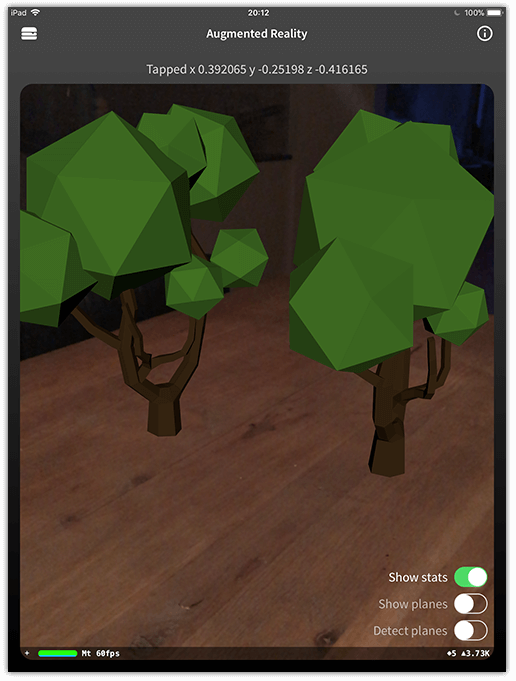

# Preview of Augmented Reality in NativeScript

Coinciding with the official release of iOS 11, we are pleased to announce a preview of augmented reality (AR) support in NativeScript!

div style='position:relative;padding-bottom:54%'><iframe src='https://gfycat.com/ifr/SecondaryKindCrayfish' frameborder='0' scrolling='no' width='100%' height='100%' style='position:absolute;top:0;left:0' allowfullscreen></iframe>

The respective releases of AR SDKs from Apple ([ARKit](https://developer.apple.com/arkit/)) and Google ([ARCore](https://developers.google.com/ar/)) have presented an opportunity for NativeScript to enable developers to create immersive cross-platform AR experiences. The app in the video above was created with an alpha version of our soon-to-be-released `nativescript-ar` plugin. Today, this plugin leverages the ARKit APIs available in iOS 11. In the near future, support will be added for Android via the ARCore APIs.

While devices must be running iOS 11 to use ARKit, due to how NativeScript APIs are loaded at runtime, if you use the `nativescript-ar` plugin you can still target lower versions of iOS. This means you can add supplemental AR features to your app without disturbing iOS <= 10 users.

> iOS 11 will support iPhone 6S and newer devices.

ARCore on Android is a different story, as Google is limiting ARCore support to Android 8 (Oreo) running on the Samsung Galaxy S8 and Google Pixel devices. While support will surely broaden, Android vendors are notoriously slow to update to the latest version of Android.

The canonical way to use AR is by first detecting surfaces and then placing objects on (or above) the surface. Said objects can be anything from cubes and spheres to full-blown 3D models using hundreds of thousands of polygons. The objects can have a mass so gravity can affect them.

> Looking for a free repository of 3D models for your next AR project? Take a look at [turbosquid.com](https://www.turbosquid.com/Search/3D-Models/free).

## How About Some Code?

The goal of our AR plugin is to eliminate unnecessary platform-specific confusion and provide a clean and concise API. Usage will be as simple as adding an `<AR></AR>` element to your view and adding events and properties to guide its behavior:

	<AR (arLoaded)="arLoaded($event)"
	    (planeDetected)="planeDetected($event)"
	    (planeTapped)="planeTapped($event)">
	</AR>

The `<AR></AR>` element can be part of any ordinary NativeScript layout or you can even go full screen. In either case, you have the option to overlay other standard NativeScript UI elements on top of it.

With the `nativescript-ar` plugin, you will be able to catch events and interact programmatically with the camera feed on your screen. For example, you can get notified of what coordinate of a plane was tapped with:

	<AR (planeTapped)="planeTapped($event)">

...and then forward the `planeTapped` event to your component to add (in this example) a 3D model of a tree to that specific point in the scene:

	planeTapped(position: ARPosition): void {
		this.ar.addModel({
			name: "art.scnassets/Lowpoly_tree_sample.dae",
			childNodeName: "Tree_lp_11",
			position: position,
			scale: 0.01, // tree
			mass: 0.0002,
			onLongPress: ((model: ARNode) => {
				model.remove();
			})
		});
	}

## When Can I Get It?

When it's ready 😄.

The `nativescript-ar` plugin is in active development today. When we release the first version, it will support only ARKit due to the aforementioned rollout delays with ARCore on Android. However, the ARKit and ARCore APIs are relatively similar and during development we are keeping in mind the overall footprint to make sure our abstraction is truly cross-platform.

Regardless, due to the large API surface of both SDKs (and thanks to the [capabilities of NativeScript](https://docs.nativescript.org/core-concepts/accessing-native-apis-with-javascript)), developers will always be able to tap into the more obscure platform-specific APIs if they are not exposed via the plugin.

Here at Progress we are extremely excited about the future of augmented reality on mobile and are happy that NativeScript is helping to lead the way.