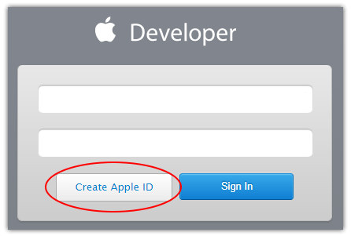
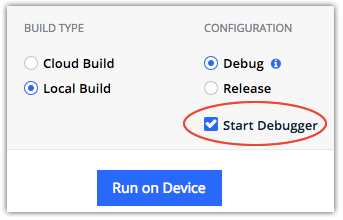
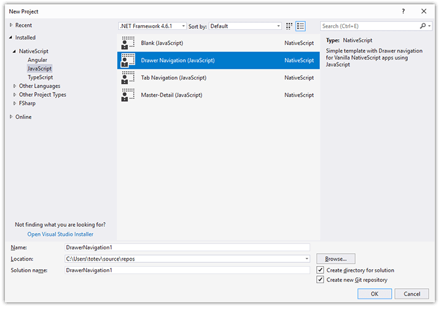
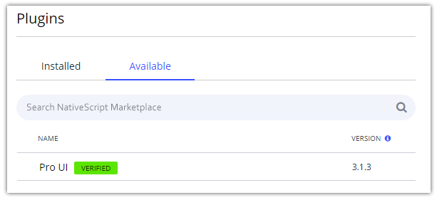

# NativeScript Sidekick Updates Announced at Developer Day

Did you make it to [NativeScript Developer Day](http://developerday.nativescript.org/) in the Big 🍎 last month? If not, you missed some fantastic sessions on the NativeScript framework, along with numerous NativeScript tooling announcements. Luckily for you, we are blogging about these same updates!

Next up this week is every NativeScript superhero's favorite companion: [NativeScript Sidekick](https://www.nativescript.org/nativescript-sidekick).

**Let's jump right into the big updates:**

- [Auto Generate iOS Provisioning Profiles and Certificates](#ios-provisioning-cert)
- [Create iOS CSR on Windows](#ios-csr-windows)
- [Deploy, Debug, and LiveSync](#debug)
- [Preview of Visual Studio Extension](#visual-studio)
- [NativeScript Marketplace Integration](#marketplace)

## Auto Generate iOS Provisioning Profiles and Certificates

The bane of iOS development, Apple's $99/year developer accounts are a sure-fire way to discourage hobbyist developers from experimenting with iOS app dev. However, did you know you can create a **free** Apple developer account and use that for sideloading apps on iOS devices?

Simply [create an Apple ID](https://appleid.apple.com/account#!&page=create) and Apple will automatically provide you with a free (albeit limited, see below) Apple developer account.

If having access to a free iOS developer account isn't enough, how about handling the pain of iOS device provisioning and certificate generation for you? Now in Sidekick you can request iOS development certificates and provisioning profiles be created when you deploy your app to a connected device. With an iOS device connected, simply choose **Run on Device** from the **Run** menu:

Behind the scenes, Sidekick pulls your connected device id and associates that id with a provisioning profile for you!

*Note that due to Apple restrictions, this workflow only works for free Apple developer accounts. See the next section if you already have a paid developer account.*

> While the free Apple developer accounts allow you to develop/sideload an iOS app locally, you will need to purchase a $99 account to publish an app to the App Store.

## Create iOS CSR on Windows

Windows developers rejoice! In this round of Sidekick updates you no longer need access to a Mac to generate your development certificates.

From the **Tools** menu, choose **Certificate Signing Request**. From here you can generate a CSR and use that in the [iOS developer center](https://developer.apple.com/account/) to create your certificate: 

> [Review the Sidekick docs](http://docs.nativescript.org/sidekick/user-guide/code-signing/code-signing-for-ios/ios-developer-program.html) for a full explanation of the CSR workflow.

And soon you won't need a Mac for *any* part of your iOS development process! You don't need a Mac for builds (due to Sidekick's cloud builds), you don't need a Mac to generate certificates or profiles, and in a coming release you won't need a Mac for app store publishing. Stay tuned!

## Deploy, Debug, and LiveSync

We've made significant improvements to the Sidekick debugging workflow. Now when you create a `debug` build and run it on a connected device, you can specify that the debugger starts immediately:

...and your Chrome dev tools will open, allowing you access to a plethora of debugging utilities. **LiveSync is now enabled by default**, and works perfectly alongside your debugging tools!

## Preview of Visual Studio Extension

While we realize the NativeScript [Visual Studio Code add-on](https://www.nativescript.org/nativescript-for-visual-studio-code) is wildly popular, our classic Visual Studio developers may be feeling left out in the cold. That's why we are pleased to announce that a preview version of our NativeScript extension for Visual Studio 2015/2017 is coming soon!

**Using this native Visual Studio extension, you will be able to leverage Sidekick features from within your beloved IDE.** Perform cloud builds, local builds, access the debugger, and LiveSync your way to a cross-platform mobile app in no time.

We are planning on releasing a preview of the Visual Studio extension within the next few weeks!

## NativeScript Marketplace Integration

At NativeScript Developer Day, we announced the creation of the [NativeScript Marketplace](http://market.nativescript.org/). Is this just another plugin repository? Heck no! The marketplace is not only a source of plugin discovery, but we are also providing assurance and **verifying** plugin functionality. The days are gone of trying to compare plugins that claim to perform the same functions. Going forward our engineering teams will be placing a stamp of approval on certain plugins to help you choose the right plugin for your mission-critical app.

Coming soon in Sidekick is the ability to query the NativeScript Marketplace directly to access new plugins and update existing plugins:

> [Check out this article](https://www.nativescript.org/blog/nativescript-marketplace---discover-high-quality-plugins-templates-and-tools) that dives deeper into what the marketplace provides.

## Ready to Try Sidekick?

If you haven't tried NativeScript Sidekick yet, [grab your own free copy today](https://www.nativescript.org/nativescript-sidekick) - it works equally well on Windows, Mac, and Linux.