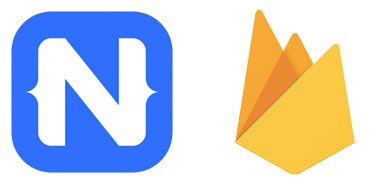
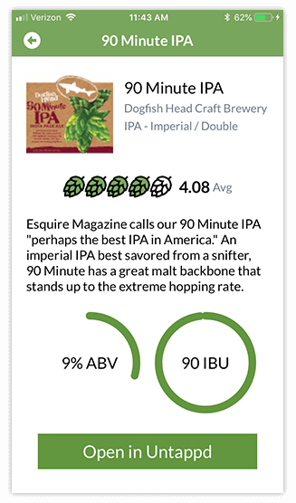

# Using ML Kit for Firebase to Tap into Beer Ratings

Over the past year machine learning (ML) has gone mainstream. How do we know this? When we let [computers create paint colors](https://arstechnica.com/information-technology/2017/05/an-ai-invented-a-bunch-of-new-paint-colors-that-are-hilariously-wrong/):

Much like with augmented reality, we are still collectively working out the most practical applications for ML. But the best use of any new technology solves an existing real world problem. **For me, the king of (first world) problems is deciding which beer to drink.**

How many times have you entered a restaurant or bar and been assaulted with a beer menu of copious choices, about 5% of which you've heard of?

I decided it was in my palette's best interest to create a mobile app that would allow me to leverage:

- [NativeScript](https://www.nativescript.org/) to create a native cross-platform mobile app with JavaScript;
- [ML Kit for Firebase](https://firebase.google.com/docs/ml-kit/) to read a menu and return beer names;
- [Untappd](https://untappd.com/) to provide detailed beer info and ratings.

## Why NativeScript?

NativeScript is a free and open source framework that allows you to create truly native mobile apps for iOS and Android from one codebase. You use the web skills you already possess (JavaScript/TypeScript/Angular/Vue.js, CSS, and an HTML-like markup language) to create performant apps.

> If you've heard of React Native, you can think of NativeScript as React Native, but for Angular or Vue.js

I'm a big fan of skill re-use (ain't nobody got time for Swift AND Java development these days!) and I'm also a JavaScript purist, so NativeScript is a natural fit for me.

As a quick example, you can see how NativeScript's markup syntax lets you leverage native UI elements via one consistent markup language:

	<Page loaded="pageLoaded">
		<Label text="Hello ML Kit!" class="content" />
		<Button text="OK!" />
	</Page>

...and the same goes for CSS:

	Button {
		font-size: 32;
		color: orange;
	}
	
	.content {
		font-family: Lato;
		background-color: purple;
	}

## Why ML Kit?

Even though machine learning is still in its infancy, we've learned to trust Google in its infinite wisdom with bleeding-edge technologies. It doesn't hurt that NativeScript has a [robust Firebase plugin](https://market.nativescript.org/plugins/nativescript-plugin-firebase), including [support for ML Kit](https://github.com/EddyVerbruggen/nativescript-plugin-firebase/blob/master/docs/ML_KIT.md)!

If you're not familiar with [ML Kit](https://firebase.google.com/docs/ml-kit/), it's an SDK that unleashes the power of Google's machine learning capabilities to mobile apps. It's relatively easy to integrate and requires no knowledge of neural networks to get rolling.

As a mobile-focused machine learning SDK, ML Kit supports both on-device and cloud-based data models, providing easy offline functionality when needed.

## Why Untappd?

It's all fine and good to choose frameworks and services that help you achieve a technical goal, but **apps are nothing these days without data**. So when we look at retrieving beer-related data, we have a few choices in [RateBeer](https://www.ratebeer.com/), [BeerAdvocate](https://www.beeradvocate.com/), and [Untappd](https://untappd.com/).

After a little analysis, Untappd was the obvious choice. Not only is it a wildly popular beer-review service, but it has a [well documented (and free) API](https://untappd.com/api/docs). 🍻

## How the App Works

For this app we are going to leverage ML Kit's [text recognition APIs](https://firebase.google.com/docs/ml-kit/recognize-text). Yes, it's kind of like OCR, but way cooler because we get to say we are using machine learning!

> If you're interested in the full source code of the app I'm about to show you, you may [consult this GitHub repo](https://github.com/rdlauer/hoppy).

*The simplified flow of the app is:*

Take a Picture --> ML Kit Processes Picture --> Get Beer Info from Untappd

*Let's first see it in action on iOS:*

## Step-By-Step

### Take a Picture with NativeScript

We're going to take a picture of a beer menu using the NativeScript [camera module](https://docs.nativescript.org/hardware/camera). You can think of NativeScript modules as abstractions over native iOS and Android APIs.

	import { Image } from "ui/image";
	
	camera.takePicture().
	    then((imageAsset) => {
	        console.log("Result is an image asset instance");
	        var image = new Image();
	        image.src = imageAsset;
	    }).catch((err) => {
	        console.log("Error -> " + err.message);
	    });

### Call the ML Kit Text Recognition APIs

Once we have captured an image, we need to send the image file to Firebase for text recognition analysis. Here is how we handle this in the app:

	export function takePicture() {
	  camera
	    .takePicture()
	    .then(imageAsset => {
	    
	      const source = new imageSourceModule.ImageSource();
	      
	      source.fromAsset(imageAsset).then(imageSource => {
	        firebase.mlkit.textrecognition
	          .recognizeTextCloud({
	            image: imageSource,
	            modelType: 'latest', // default "stable"
	            maxResults: 10 // default 10
	          })
	          .then(function(result) {
	            // `result` is a line-by-line output of text
	            // in the app we use some regex here to filter out prices and other invalid responses
	
	            let beers = result.split('\n');
	
	            for (let i = 0; i < beers.length; i++) {
	              // hit the Untappd API here!
	            }
	          })
	          .catch(function(errorMessage) {
	            // log the ML Kit error to Crashlytics
	            console.log('MLKIT ERROR: ' + errorMessage);
	            firebase.sendCrashLog({
	              message: 'Error with ML Kit: ' + errorMessage,
	              showInConsole: true
	            });
	          });
	      });
	    })
	    .catch(function(err) {
	      // show a native alert to the user
	      alert({
	        title: 'Camera Issue!',
	        message: err.message,
	        okButtonText: 'OK',
	        cancelable: false
	      });
	    });
	}

> A keen eye will notice that we are using [Firebase Crashlytics](https://firebase.google.com/docs/crashlytics/) for error logging as well. Crashlytics is also supported in the [NativeScript Firebase plugin](https://github.com/EddyVerbruggen/nativescript-plugin-firebase/blob/master/docs/CRASHREPORTING.md).

As previously noted, ML Kit allows us to use on-device or cloud-based text recognition. In this example we are using `recognizeTextCloud`, but you can swap in `recognizeTextOnDevice` as well. You can even use NativeScript's [connectivity module](https://docs.nativescript.org/ns-framework-modules/connectivity) to determine whether or not your user is online, and thus use the appropriate ML Kit text recognition API:

	const connectionType = connectivityModule.getConnectionType();
	
	switch (connectionType) {
	    case connectivityModule.connectionType.none:
	        // Use recognizeTextOnDevice
	        break;
	    case connectivityModule.connectionType.wifi || connectivityModule.connectionType.mobile:
	        // Use recognizeTextCloud
	        break;
	    default:
	        break;
	}

Along with *text*, ML Kit also returns *bounding polygon* data, showing you where on the image it identified the text. Potential augmented reality application anyone!?

### Call the Untappd APIs

In order to avoid a ridiculous amount of code above, I did put a comment placeholder in where the magic of hitting the Untappd API occurs. Those API calls are relatively simple.

First, we need to perform a beer search to see if the text returned from ML Kit is *actually* a beer name:

	https://api.untappd.com/v4/search/beer/?q=" + beer + "&client_id=<CLIENT_ID>&client_secret=<CLIENT_SECRET>&access_token=" + access_token
	
For clarification, `beer` is the beer name we want to check, `client_id` and `client_secret` are the keys you'll get after you register your app with Untappd, and `access_token` is the auth token provided when you log your user into Untappd.

> **NOTE:** You have the option of *not* authenticating your end users, but then API calls are restricted to 100/app/hour by Untappd.

If the API call returns a result, we then have to make *another* API call to retrieve more detailed information about the beer:

	https://api.untappd.com/v4/beer/info/" + result.bid + "?compact=true&client_id=<CLIENT_ID>&client_secret=<CLIENT_SECRET>&access_token=" + access_token
	
Again, in this case `result.bid` is just the beer id returned from our first API call.

This will return a nice JSON-formatted resultset for us to populate our UI (below being a heavily-condensed version for readibility).

Spotted Cow is an honored favorite of Wisconsin microbrews! 🍺🐄

	{  
	  "beer":{  
	     "bid":3770,
	     "beer_name":"Spotted Cow",
	     "beer_label":"https:\/\/untappd.akamaized.net\/site\/beer_logos\/beer-SpottedCow_3770.jpeg",
	     "beer_abv":4.8,
	     "beer_ibu":18,
	     "beer_description":"You know you're in Wisconsin when you see the Spotted Cow.",
	     "beer_style":"Saison \/ Farmhouse Ale",
	     "rating_count":139674,
	     "rating_score":3.8887,
	     "stats":{  
	        "total_count":349790,
	        "monthly_count":3107,
	        "total_user_count":156283,
	        "user_count":0
	     },
	    "brewery": {
	      "brewery_id": 907,
	      "brewery_name": "New Glarus Brewing Company",
	      "brewery_type": "Micro Brewery",
	      "brewery_label": "https://untappd.akamaized.net/site/brewery_logos/brewery-NewGlarusBrewingCompany_907.jpeg",
	      "brewery_description": "Welcome to our quaint little brewery nestled on the outskirts of New Glarus, Wisconsin."
	    }
	  }
	}

We then bind the resultset to a [NativeScript ListView](https://docs.nativescript.org/ui/list-view) to provide a native scrolling list (presented here without class attributes to improve readibility).

	<ListView items="{{ myBeers }}" itemTap="beerTap">
		<ListView.itemTemplate>
			<GridLayout rows="auto" columns="auto, *, auto">
				<Image row="0" col="0" src="{{ image }}" />
				<StackLayout row="0" col="1" >
					<Label text="{{ name }}" />
					<Label text="{{ brewery }}" />
					<Label text="{{ style }}" />
				</StackLayout>
				<StackLayout row="0" col="2">
					<StackLayout orientation="horizontal">
						<Label text="{{ score }}" />
						<Label text=" Avg" />
					</StackLayout>
					<StackLayout orientation="horizontal">
						<!-- rating icons provided via background-image CSS property -->
						<StackLayout class="{{ score_img_1 }}"></StackLayout>
						<StackLayout class="{{ score_img_2 }}"></StackLayout>
						<StackLayout class="{{ score_img_3 }}"></StackLayout>
						<StackLayout class="{{ score_img_4 }}"></StackLayout>
						<StackLayout class="{{ score_img_5 }}"></StackLayout>
					</StackLayout>
				</StackLayout>
			</GridLayout>
		</ListView.itemTemplate>
	</ListView>
	

> A NativeScript ListView is an abstraction on top of Android's [android.widget.ListView](https://developer.android.com/reference/android/widget/ListView) and iOS's [UITableView](https://developer.apple.com/documentation/uikit/uitableview)
	
You'll notice the `beerTap` method executed on `itemTap`. This will navigate us to a new view that shows more details about the selected beer:

	<StackLayout orientation="horizontal">
		<Image src="{{ image }}" />
		<StackLayout>
			<Label text="{{ name }}" textWrap="true" />
			<Label text="{{ brewery }}" textWrap="true"  />
			<Label text="{{ style }}" textWrap="true"  />
		</StackLayout>
	</StackLayout>
	<StackLayout orientation="horizontal">
		<!-- rating icons provided via background-image CSS property -->
		<StackLayout class="{{ score_img_1 }}"></StackLayout>
		<StackLayout class="{{ score_img_2 }}"></StackLayout>
		<StackLayout class="{{ score_img_3 }}"></StackLayout>
		<StackLayout class="{{ score_img_4 }}"></StackLayout>
		<StackLayout class="{{ score_img_5 }}"></StackLayout>
		<Label text="{{ score }}" />
		<Label text=" Avg" />
	</StackLayout>
	<Label text="{{ desc }}" textWrap="true" />
	<StackLayout orientation="horizontal">
		<!-- progress bars provided by NativeScript UI -->
		<circProgAbv:CircularProgressView id="cpAbv" />
		<circProgIbu:CircularProgressView id="cpIbu" />
	</StackLayout>
	<Button text="Open in Untappd" tap="openUntappd" />
	

## Conclusion

The power of leveraging Firebase services with NativeScript and the [NativeScript-Firebase plugin](https://github.com/EddyVerbruggen/nativescript-plugin-firebase) can't be understated. You can create dynamic, engaging mobile apps for both iOS and Android from one codebase; saving time, money, and a load of headaches.

You can get started with NativeScript (without installing anything on your local machine) by accessing the [NativeScript Playground](https://play.nativescript.org/). Setting up a [new Firebase account](https://console.firebase.google.com/) takes about a minute and has very generous free offerings.

The app you see here (Hoppy) is completely free and available on the [iOS App Store](https://itunes.apple.com/us/app/hoppy-discover-beer-ratings/id1406526158?ls=1&mt=8) and [Google Play](https://play.google.com/store/apps/details?id=org.nativescript.hoppy).

Cheers! 🍻