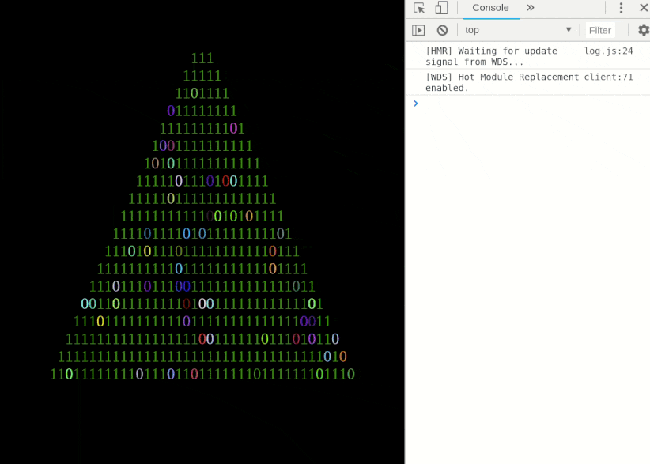
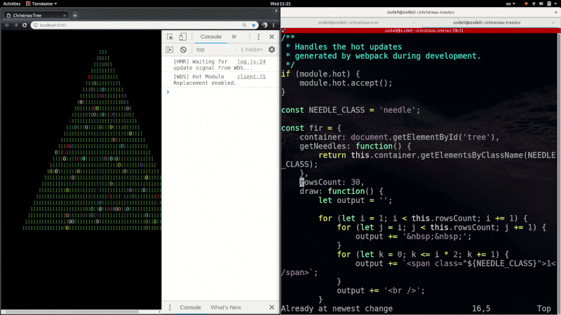
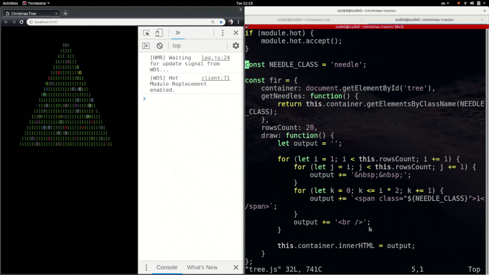
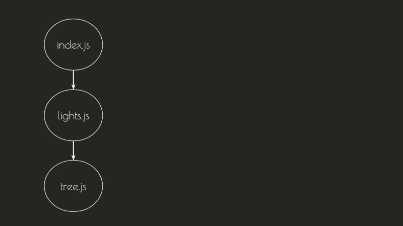
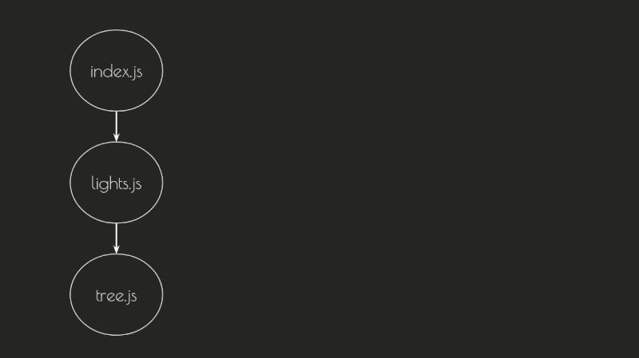
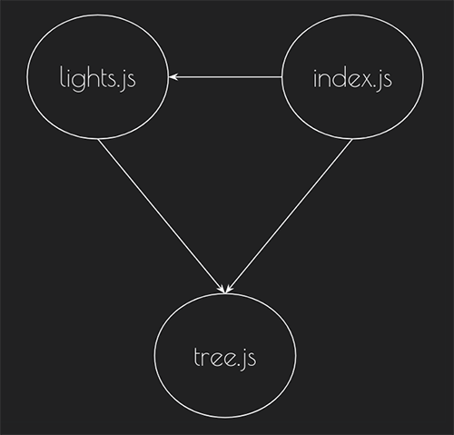
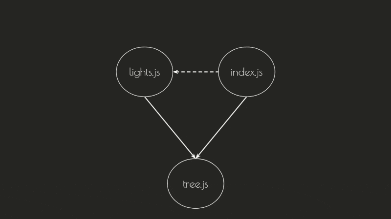
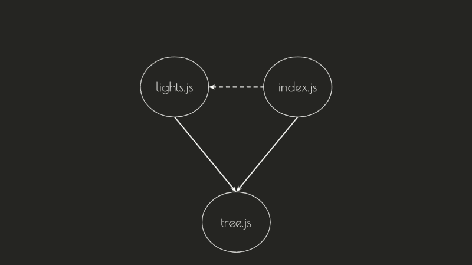

# A Deep Dive into Hot Module Replacement with Webpack (Part Two - Handling Updates)

This article is the second part of a "deep dive" series on Hot Module Replacement with [webpack](https://webpack.js.org/).

- Part 1: [The Basics]() TODO: INSERT LINK!
- **Part 2: Handling Hot Updates with the `module.hot` API**

## Part 2: Handling Hot Updates with the module.hot API

In the first blog post of the HMR series, we discussed the four stages of the *Hot Module Replacement* process.

Today, we will focus on the last stage. We will learn how to instruct the modules in our application to refresh themselves when they receive a hot update.

The *hot update handlers* can either be injected by a webpack loader during the build, or be manually added by you. We will discuss only the second way in this article. Webpack exposes a public interface from the `module.hot` object. Let's explore it!

## The module.hot API

For our demos, we'll tinker with a simple webpage. It's best if you clone the project and follow the instructions, but it's not mandatory. You could also just read the blog post and trust me that everything works.

Clone the repository from [https://github.com/sis0k0/christmas-tree](https://github.com/sis0k0/christmas-tree). If you're a fan of the command-line interface, execute:

	git clone https://github.com/sis0k0/christmas-tree.git

Navigate to the cloned folder and install the dependencies:

	cd christmas-tree
	npm install

To run the development server, execute:

	npm run watch

After the build finishes, a new tab in your browser will open. Toggle the devtools console.

Merry Christmas! Yeah, I know it's February. But you haven't put down your Christmas decorations either, have you?

I would like you to notice two things here:

1. `npm run watch` starts the webpack development server, provided by the `webpack-dev-server` package.
1. The console says that *Hot Module Replacement* is enabled. By default, it is not. This project is *configured* to run with HMR. We will find out how in the next section.

## What's in the Project?

The image below shows the project structure (excluding `node_modules`):

The `source` directory is where we will be making changes:

- `index.js` imports all source files. That's the *entry* module for webpack;
- `lights.js` creates the blinking effect for the Christmas tree;
- `tree.js` draws the tree itself.

The `dist` directory hosts the ready-to-run application.

- `main.js` is the single output *bundle*, produced by webpack;
- `index.html` is the web page that loads `main.js`.

We won't discuss `package.json` and `package-lock.json` in this post. If you want to learn more about them, check out the [npm docs](https://docs.npmjs.com/files/package.json).

And finally, `webpack.config.js` - the place where we instruct webpack how to *bundle* our application. The application runs with *HMR* because the *Hot Module Replacement* plugin is part of the configuration:

	const path = require('path');
	const webpack = require('webpack');
	
	module.exports = (env, argv) => {
	    const config = {
	        entry: './src/index.js',
	        output: {
	            filename: 'main.js',
	            path: path.resolve(__dirname, 'dist')
	        },
	        devServer: {
	            contentBase: './dist',
	            hot: true,
	        },
	        plugins: [],
	    };
	
	    if (argv.mode === 'development') {
	        config.plugins.push(
	            new webpack.HotModuleReplacementPlugin()
	        );
	    }
	
	    return config;
	};

## Self-Accepted Modules

Enough theory, let's go back to the browser. The devtools console says that *hot module replacement* is running. But does it really work? 🤔

Open `src/tree.js` and increase the value of `rowsCount`.

We get a bigger tree, but also a full page reload. It can be hard to notice it. Look at the messages in the console - they disappear when the reload starts. When the scripts on the page are executed anew, the messages appear again. The goal of HMR is to avoid full page reloads.

Currently, the application doesn't accept *hot updates*, because we haven't instructed it to do so. Therefore, the `webpack-dev-server` falls back to a full page reload.

The easiest way to handle an incoming update is by *self-accepting* it from the changed module. This will cause webpack to execute the new version of the module. All we need to add is:

**src/tree.js**

	module.hot.accept();

However, the `module.hot` property is defined only when HMR is enabled. If we build the application for production, without HMR, the above code will throw an error. We need a check:

**src/tree.js**

	if (module.hot) {
	    module.hot.accept();
	}

One final note before trying it out - when we build for production, webpack knows that `module.hot` is *undefined* and the code block, guarded by the if statement, will never be executed. The *UglifyJS/Terser* plugin for webpack will remove it from the bundle. We don't have to worry that our development settings will end up in production.

Let's change the `rowsCount` again and see what happens. The page is not fully reloaded, but the tree still updates, because the new `tree.js` module is executed.

## Disposal of Old Modules

There's one more module in our simple app - `src/lights.js`, which "illuminates" the tree.

**src/lights.js**

	import fir from './tree.js';
	
	/**
	 * Changes the look of
	 * some 'needles' in the tree
	 * every 1000ms
	 */
	function turnOn() {
	    const blinkRate = 1000;
	    const rowsCount = fir.rowsCount;
	    const needles = fir.getNeedles();
	
	    setInterval(() =>
	        blink(rowsCount, needles),
	        blinkRate
	    );
	}
	
	turnOn();
	// ...

To make `lights.js` a self-accepted module, we need to extend it with the same code that we used for `tree.js` earlier:

	if (module.hot) {
	    module.hot.accept();
	}

Now, let's try decreasing the `blinkRate` to make the lights go faster and increasing it for the opposite effect.

We didn't quite get the behavior we wanted. The light bulbs become more and more with every change. The *self-accept* causes webpack to execute the module whenever a *hot update* is needed.

**src/lights.js**

	function turnOn() {
	...
	    setInterval(() =>
	        blink(rowsCount, needles),
	        blinkRate
	    );
	}
	
	turnOn();  // <-- gets called every time the module is changed

Executing the code above has a side effect - it triggers a repeating action with the `setInterval` call. We never cancel the already started actions, but keep triggering new ones. Luckily, webpack provides a mechanism for *disposing* old modules before replacing them.

First, we need to keep the ID of the started action:

**src/lights.js**

	let lightsInterval;
	function turnOn() {
	...
	    lightsInterval = setInterval(() =>
	        blink(rowsCount, needles),
	        blinkRate
	    );
	}

Then, we can clear it *before* the new module is executed:

**src/lights.js**

	if (module.hot) {
	    module.hot.accept();
	    module.hot.dispose(_data => {
	      clearInterval(lightsInterval);
	    });
	}

And finally, we can try changing the `blinkRate` again:

## Parent-Accepted Modules

So far, we instructed webpack to execute the `tree.js` and `lights.js` modules whenever we change their code. The hot module replacement seems to work surprisingly well when the changed data is internal. But, what would happen if instead, we modify the public interface of a module? What would happen to the other modules depending on that interface 😱?

The `tree.js` module exports a single object - `fir`:

- the `fir.draw()` function visualizes the tree inside a container DOM element. It replaces the contents of the container with span elements needles. Each needle gets a `className` equal to the value of the `NEEDLE_CLASS` constant;
- the `fir.getNeedles()` function returns all DOM elements with the above `className`.

The `lights.js` module imports `tree.js` and uses `fir.getNeedles()` to obtain a list of the newly drawn DOM elements. The list is critically important for illuminating the Christmas tree. This is what the dependency graph looks like:

Let's put the HMR process to the test by modifying the value of `NEEDLE_CLASS` in `tree.js`.

**Our lights went out!** The HMR process failed the test miserably.

Webpack executed `tree.js` when we changed it. The `fir.draw()` function created brand-new needles with `classNames` matching the new value of `NEEDLE_CLASS`. It also got rid of the previous needles.

However, nothing happened in `lights.js`. Its list of needles still references the old, already removed needles. We should refresh that list when `tree.js` is changed.

The *parent accept* API allows us to handle hot updates for a module from other modules that import it. We can extend the HMR logic in `lights.js` to restart the bulbs whenever `tree.js` is changed:

**src/lights.js**

	if (module.hot) {
	    module.hot.accept(['./tree.js'], function() {
	        clearInterval(lightsInterval);
	        turnOn();
	    });
	    ...
	}

Now we have update handling logic for `tree.js` in two places:

- *parent accept* in `lights.js`;
- *self accept* in the `tree.js` module itself.

But which one will be preferred?

## Refresh Strategies

Let's visualize all possible update handling scenarios for `tree.js`:

### Self Accept in tree.js

If there is a *self accept* in `tree.js`, webpack executes the module. The modules that import `tree.js` (its "parents") are not notified of the change.

### Parent Accept in lights.js

If there is no *self accept* in `tree.js`, webpack looks for update handlers inside the modules that import it.

The `lights.js` module imports `tree.js`. Let's say that it has a handler for it:

	module.hot.accept(['./tree.js'], function updateHandler() {
	    ...
	});

Webpack will:

- execute `tree.js`;
- update the `tree.js` import inside `lights.js` to point to the new module;
- execute the `updateHandler()`.

### Parent Accept in index.js

If there is no handler for `tree.js` in `lights.js`, webpack will continue looking up the dependency graph.

The `index.js` module imports `lights.js`. Webpack will check if it contains a handler for `lights.js`. I want to highlight this part - it won't check for a handler for `tree.js` (the changed module), but for `lights.js` (the module it actually imports). Let's imagine for a moment that `index.js` has a handler:

**src/index.js**

	module.hot.accept(['./lights.js'], function updateHandler() {
	    ...
	}

Webpack will:

- execute `tree.js`;
- execute `lights.js` (the imported `tree.js` module is updated)
- update the reference to `lights.js` inside `index.js`;
- execute the `updateHandler()`.

### No Update Handlers for tree.js

Webpack continues looking for handlers until it finds a *'root' module* - a module, that's not imported in any other module. In that case, the `webpack-dev-server` will fallback to a full page reload, and in the case of NativeScript - an app restart.

## Choosing an Update Handler

Back to the tree - we noticed that there are two update handlers for `tree.js`. We want webpack to use the new logic in `lights.js`. That's why we have to remove the *self accept* from `tree.js`.

**src/tree.js**

	// comment or simply delete the code below
	// if (module.hot) {
	//     module.hot.accept();
	// }

Let's try changing the value of `NEEDLE_CLASS` again:

Aaaand...the HMR process fails. Instead of a refresh, we get a full page reload.

I must admit that I lied to you. The `tree.js` module is actually imported not only in `lights.js` but also in `index.js`. This is the real dependency graph:

The changed module should have an update handler in **every** branch of its dependency graph. Currently, we are not accepting the changes for `tree.js` in `index.js` and the upcoming hot update is rejected.

> Notice that if we have only one root module, we can add an application-wide update handler in it. We won't do that in our project for now.
For example, if you're using Angular your task is a little easier, as most Angular apps have a single entry module - `main.ts`, which bootstraps the app. If there are no lazy loaded NgModules, main.ts will be the only root module. Adding the following handler to it will catch all hot updates in the app:

	if (module.hot) {
	    module.hot.accept(["./app/app.module"], function() { ... });
	}
	
	import { AppModule } from "./app/app.module";
	...

Back on our project again - we need a *parent accept* for `tree.js` inside `index.js`. And we don't even need a callback.

**src/index.js**

	if (module.hot) {
	    module.hot.accept(['./tree.js']);
	}

Now the handler look-up process will be successful, because the hot updates for `tree.js` are accepted in all of its parents.

Let's try changing the value of `NEEDLE_CLASS` one last time before we give up:

## Refactoring

Yeyyy! It works! But...

The code we wrote doesn't really...feel good to me. The *parent accept* in `index.js` seems a bit artificial - it's there only because we have to accept the upcoming update. And what if we add a new module that imports `tree.js`? We will have to add an update handler inside it too! It's time to refactor.

Currently, we need to accept the `tree.js` changes in `index.js` and `lights.js`, because both modules import it.

Let's take a look at how `lights.js` uses `tree.js`:

**src/lights.js**

	import fir from './tree.js';
	
	function turnOn() {
	    const rowsCount = fir.rowsCount;
	    const needles = fir.getNeedles();
		...
	}
	 
	turnOn();

Instead of importing `fir`, we can make it a parameter of the `turnOn` function. In that case, the function shouldn't be called, but exported instead.

**src/lights.js**

	// import fir from './tree.js';
	
	export function turnOn(fir) {
	    const rowsCount = fir.rowsCount;
	    const needles = fir.getNeedles();
		...
	}
	 
	// turnOn();

We are not importing `tree.js` anymore and we can also remove the handler for it:

**src/lights.js**

	if (module.hot) {
	    // module.hot.accept(['./tree.js'], function() {
	    //    clearInterval(lightsInterval);
	    //    turnOn();
	    // });
	    module.hot.accept();
	    module.hot.dispose(_data => {
	      clearInterval(lightsInterval);
	    });
	}

Whoever uses `lights.js` will have to import the `turnOn` function, call it, and provide the `fir` object as an argument. In our case the importer is `index.js`. After doing the necessary modifications, `index.js` should look like that:

**src/index.js**

	import fir from './tree.js';
	import { turnOn } from './lights.js';
	
	turnOn(fir);
	
	if (module.hot) {
	    module.hot.accept(['./tree.js']);
	}

Now, we have an update handler for `tree.js` only in `index.js`. We can move the refresh logic for `lights.js` inside it. Let's export a function that "restarts" the lights:

**src/lights.js**

	export function restart(fir) {
	    clearInterval(lightsInterval);
	    turnOn(fir);
	}

And call that function from the update handler in `index.js`:

**src/index.js**

	import fir from './tree.js';
	import { turnOn, restart } from './lights.js';
	
	turnOn(fir);
	
	if (module.hot) {
	    module.hot.accept(['./tree.js'], () => {
	        restart(fir);
	    };
	}

Let's test out the changes we did by modifying the `tree.js` file.

Editing `tree.js` still works!

However, now the `lights.js` module is self-accepted and no longer imports `tree.js`. If we try to modify it, the tree won't be redrawn. We need to move the `lights.js` update handler to `index.js` as well.

**src/index.js**

	if (module.hot) {
	    // add ./lights.js to the list of accepted dependencies 
	    module.hot.accept(['./tree.js', './lights.js'], () => {
	      restart(fir);
	    });
	}

Don't forget to remove the self accept from `lights.js`.

**src/lights.js**

	if (module.hot) {
	    // Comment or remove the line below
	    // module.hot.accept();
	    // Keep the disposal logic!
	    module.hot.dispose(_data => {
	      clearInterval(lightsInterval);
	    });
	}

That's it! Refactoring done! Let's stop making changes before we break something...

## Summary

You can find the HMR-charged version of the demo in the branch, called finished: [https://github.com/sis0k0/christmas-tree/tree/finished](https://github.com/sis0k0/christmas-tree/tree/finished)

There is (at least) one bug in the disposal logic of the application. Try to find it! Feel free to open a PR in the Github repo. The first to do it, may (or may not) win something nice 🙂.

We learned how to use the `module.hot` API to manually handle hot updates. Some frameworks, like React, Vue, Angular, and NativeScript, provide built-in HMR support. In a dedicated article, we will explore how each framework solves the problem of refreshing the application and keeping its state intact.