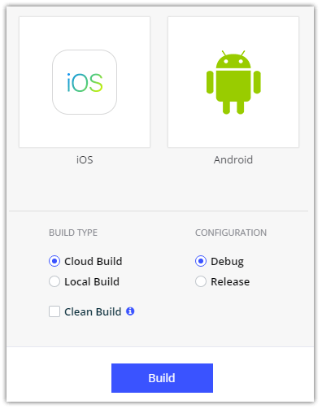
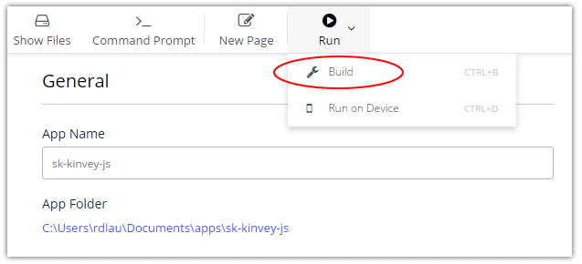

# Develop iOS Apps on Windows with NativeScript Sidekick

Recently we announced version 1.0 of [NativeScript Sidekick](https://www.nativescript.org/nativescript-sidekick). This is a new desktop application (for Windows, Mac, and Linux) that simplifies your NativeScript development experience. So, to celebrate, this week is all about Sidekick on the NativeScript blog! Every day we will do a deep dive into some of the most valuable features of Sidekick.

Today is all about building in the cloud and what Sidekick can do for Windows developers!

- Intro to Sidekick
- Starter Kits
- Cloud Builds and iOS on Windows Features (today!)
- Debugging and LiveSync (coming Thursday)
- Resource and Settings Management (coming Friday)

Let's look more closely at the time-saving (and headache-reducing) cloud build feature of Sidekick - and also see how else Sidekick helps out us Windows developers!

## What's a Cloud Build? ☁️ 🏗️

Normally when you create the IPA file (for iOS) or APK file (for Android), you're using the native SDKs installed on your machine. For iOS you are using the Xcode tools and for Android you are using the Android SDK. The problem with building your apps locally is the amount of time it takes to download, install, and configure these tools. Is it doable? Absolutely.

*But what if you didn't have to?*

> We provide a full installation guide on setting up these dependencies as part of our [getting started tutorials](https://docs.nativescript.org/).

With NativeScript Sidekick you can leave SDK management to us, literally. You simply tell Sidekick to build your app in our cloud and we will deliver you the IPA and/or APK app package back to you. Your NativeScript assets are secure in their delivery, and we don't store your data in the cloud.

Typically cloud builds are considered much slower than local builds. This is natural, as local builds are running on your own hardware and files don't have to be transferred over any network. However, Sidekick cloud builds are fast. Ridiculously fast. In fact, there is a chance that our cloud builds end up being comparable in speed your local builds. Why? Sidekick builds are run on the latest Mac Pros with a fast network connection to make sure your files are uploaded, built, and downloaded as fast as possible.

As a "bake off", I compared the local Android build of the "blank" NativeScript starter kit to a cloud build. Here were my results:

- Local Build: 8 seconds
- Cloud Build + Upload/Download: 38 seconds

Not too bad!

> Of course, your mileage may vary. Total build times will depend on size of the app and your network speed.

## Can I Still Build Locally?

Yes, definitely. If you already have the appropriate SDKs set up locally, you can simply choose to perform a "local" build within Sidekick.

## How Do I Create a Build with Sidekick?

It couldn't be much easier. With an app open in Sidekick, go to the **Run** menu and choose **Build**.

In the window provided, choose between iOS or Android builds and make sure **Cloud Build** is selected.

> Leave **Clean Build** unchecked, unless you know you need to delete the cache before a build.

The trick comes with building on iOS, as you need a certificate and provisioning profile. With Android release builds, you also need a certificate for publishing to Google Play. No worries though! We have comprehensive docs already that focus on the [iOS code signing process](https://docs.nativescript.org/sidekick/user-guide/code-signing/code-signing-for-ios/ios-developer-program). We also provide a mechanism for generating these certificates - see below!

## What About Continuous Integration Builds?

As a GUI desktop application, Sidekick isn't the first thing you consider when thinking about your continuous integration (CI) process. However, we are actively looking into options to expose our cloud build services via the NativeScript CLI. Stay tuned for more info in the coming weeks and months!

## iOS Development on Windows!?!

Clearly the ability to create a build of an iOS from Windows using Sidekick is a huge advantage to us Windows developers. But there are other features we expose to make your life even easier:

Sidekick also allows you to generate certificates for app signing, starting with a CSR:

Not to mention, if you don't have a valid iOS provisioning profile and certificate pair, Sidekick can *automatically* generate them for you:

The final piece of the puzzle is app store submissions. Without a Mac you're unable to actually submit your binary APK file to the Apple App Store. Luckily, Sidekick allows you to build and deploy directly to the app store:

## Summary

NativeScript Sidekick is a critical component for NativeScript developers who prefer to work on Windows. You've seen today how cloud builds and provisioning profile/certificate management are made easy with Sidekick.

P.S. If you haven't already, take 10 seconds to subscribe to [NativeScript News](https://www.nativescript.org/nativescript-newsletter)!