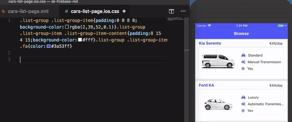
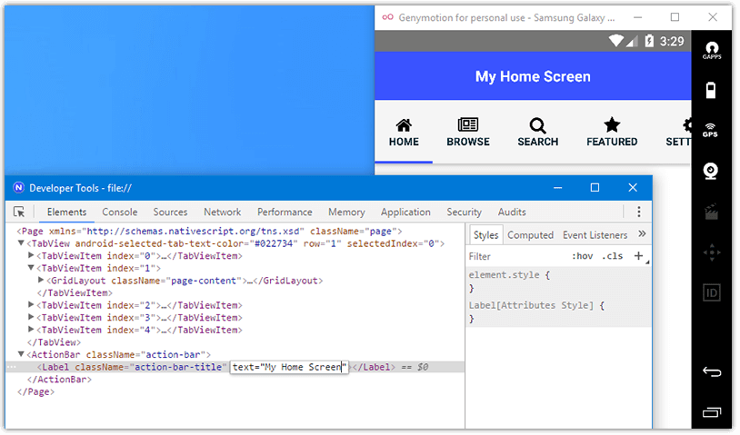
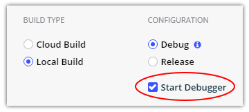
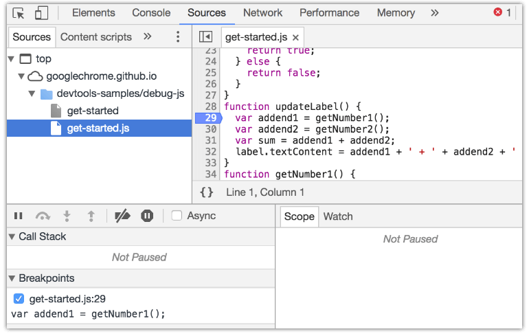
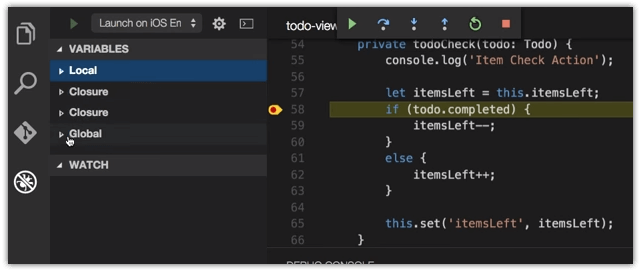

# Speed Up Your Development with NativeScript Sidekick Debugging

With the recent release of [NativeScript Sidekick](https://www.nativescript.org/nativescript-sidekick) 1.0, we unveiled an entirely new set of features and services to help improve your experience developing cross-platform mobile apps with the NativeScript framework. This week we are diving deep into some of the most valuable features of Sidekick, and today we are going to look at how Sidekick helps you squash 🐛 in your NativeScript apps!

Have you missed any of the other topics cover so far this week? If so take a look:

- Intro to Sidekick
- Starter Kits
- Cloud Builds and iOS on Windows Features
- Debugging and LiveSync (today!)
- Resource and Settings Management (coming Friday)

I know you don't write code with 🐛 or 🐜, neither do I! But let's learn about debugging with Sidekick anyway.

## LiveSync

In its most broad definition, the process of "debugging" involves iterating through changes to see why a particular code implementation isn't working they way you expected or hoped. With traditional native mobile app development, this generally means:

1. Write some code;
2. Save the changes and initiate a build;
3. Wait for the build;
4. Wait some more;
5. While waiting, realizing there is some other code you meant to change;
6. Cancel the build;
7. GOTO LINE 1;
8. ¯\_(ツ)_/¯

There is a better way! Using LiveSync, NativeScript lets you view changes you make to your app almost instantaneously. Whether said changes be to the XML markup, CSS, or JavaScript, your app will **refresh without a full rebuild**:

## Debugging

When we talk about actually *debugging* a NativeScript app, your first stop will likely be the [Chrome DevTools](https://docs.nativescript.org/tooling/chrome-devtools):

Yes, these are the same developer tools you've been using for years to inspect and debug your web apps. The question is, how do you access these tools?

Easy. When you create a build, make sure you select **Debug** and check **Start Debugger**. This will execute your build (whether it's local or cloud) and automatically start the Chrome DevTools when the app is deployed.

With the Chrome DevTools and NativeScript, you can access the following features:

- [Debugger](https://docs.nativescript.org/tooling/chrome-devtools#debugger)
- [Console](https://docs.nativescript.org/tooling/chrome-devtools#console)
- [Resources](https://docs.nativescript.org/tooling/chrome-devtools#resources)
- [Network](https://docs.nativescript.org/tooling/chrome-devtools#network)
- [Elements](https://docs.nativescript.org/tooling/chrome-devtools#elements)

> Note that not all features are available with every combination of desktop OS and mobile platform. See the [provided compatibility table](https://docs.nativescript.org/tooling/chrome-devtools) for more details.

For example, utilizing the debugger, you can **set breakpoints** and **step through** your JavaScript or TypeScript code:

While not part of Sidekick, many of you are using Visual Studio Code. Did you know you can leverage the [NativeScript extension for Visual Studio Code](https://marketplace.visualstudio.com/items?itemName=Telerik.nativescript) to utilize its built-in debugging options?

> Psst...there's a rumor that there will be a NativeScript Sidekick extension for Visual Studio 2015/2017!

## Summary

Debugging apps is often the most painful part of any developer's life. We aim to help ease that pain with NativeScript Sidekick and the extensive debugging options available.

P.S. If you haven't already, you may want to subscribe to [NativeScript News](https://www.nativescript.org/nativescript-newsletter)!