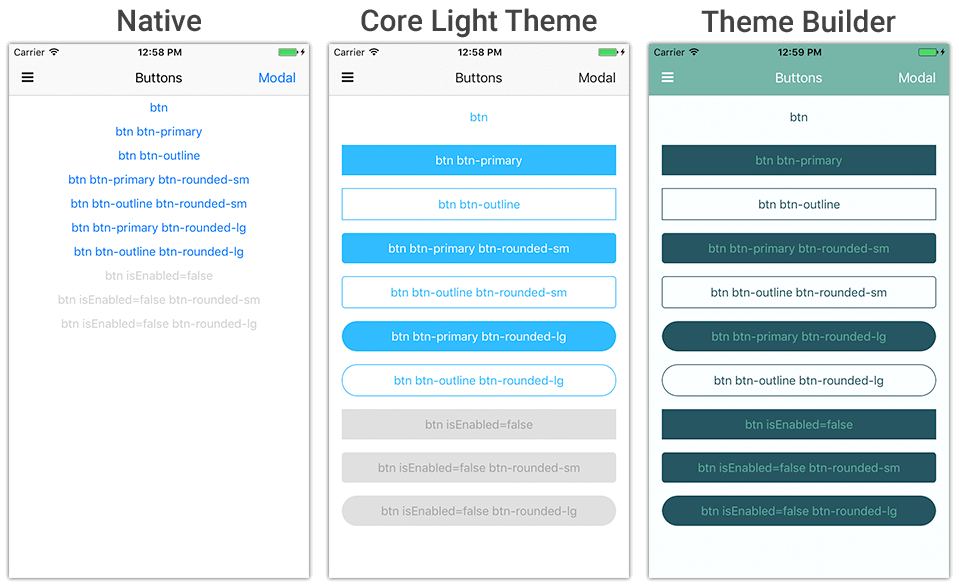
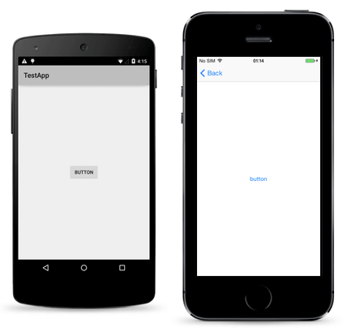
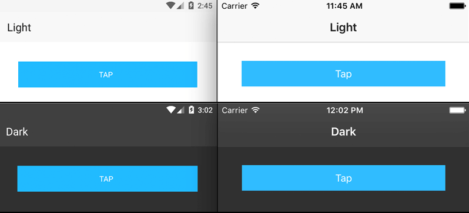
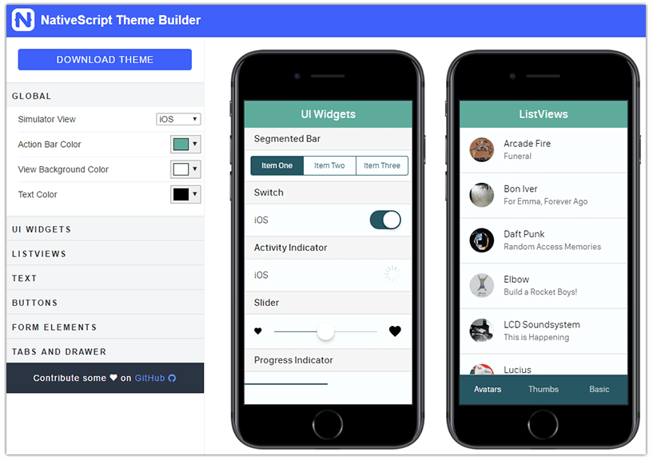

# Give Your Apps Some Style with the NativeScript Theme Builder

I'm not going to lie to you folks, I'm no designer. While at best I may have an eye for good use of white space - picking complementary colors and perfecting the layout of UI elements is far from my cup of tea. And we know that in general, app developers are more engineers than artists.

While the best of us dual-majored in CS and Fine Arts, most of us rely on other people (i.e. trained designers) to provide us what we need: gorgeous designs with color schemes that *don't* look like a 1996 Microsoft Word theme.

**Enter [NativeScript Theme Builder](http://www.nativescriptthemebuilder.com/).** The Theme Builder is a pure visual tool that can very easily take your native UI elements from dreadfully boring to gorgeously engaging:

## {N} + CSS = EMOJI

Mobile apps written with JavaScript and the NativeScript framework are fully native, and work equally well on both iOS and Android platforms. We all know this. And the way apps are styled is by using the [same CSS](https://docs.nativescript.org/ui/styling) we've known and (mostly kind of) loved for many years on the web.

And NativeScript UI elements are fully native out of the box. When we instantiate a `<Button>` it renders a truly native `UIButton` (on iOS) and `android.widget.Button` (on Android).

**But the native styles can get boring, and fast.** Leveraging the power of NativeScript and CSS allows the NativeScript Theme Builder to generate perfectly compliant styles for your native UI elements.

The trick is though, that the Theme Builder-generated CSS doesn't "just work". **You also need to use the [core themes](https://docs.nativescript.org/ui/theme) that now ship as part of the core NativeScript framework:**

> The core themes also ship with a [variety of color schemes](https://docs.nativescript.org/ui/theme#color-schemes) you can use out of the box.

Let's take a quick look at how you make this work.

## Using the NativeScript Theme Builder

To leverage themes created by the NativeScript Theme Builder, you need to follow a few simple steps:

### 1) Use the NativeScript Core Theme

Since NativeScript 2.4, the [core theme](https://docs.nativescript.org/ui/theme) has shipped as part of all NativeScript projects. If your app is, for some reason, on a version of NativeScript prior to 2.4, you can still install the core theme with: `npm install nativescript-theme-core --save`.

Open your `app.css` file, and make sure this line is included (it is by default):

	@import 'nativescript-theme-core/css/core.light.css';

### 2) Create a Style using the NativeScript Theme Builder

It's pretty self-explanatory, but navigate to the [NativeScript Theme Builder](http://www.nativescriptthemebuilder.com/) and customize all of the colors, font sizes, border radii, etc, that you desire. Once you're done, be sure to click the **Download Theme** button to get your generated CSS file.

With that downloaded CSS file in-hand, open your `app.css` file again and use another `@import` statement to reference your theme *after* the core theme:

	@import 'nativescript-theme-core/css/core.light.css';	
	@import '<your css directory>/custom.css';

### 3) Add Classes Where Needed

The core theme uses [class selectors](https://docs.nativescript.org/ui/styling#supported-selectors), not element selectors, by default. This means that each UI widget you want to style does need a CSS class applied to it. Luckily this is ridiculously easy.

For instance, if you want to apply a class to a `<SegmentedBar>` element, you would just use the following CSS class:

	<SegmentedBar class="segmented-bar">

Same goes for `<Button>` and literally every other native UI element:

	<Button class="btn btn-primary" text="I use the theme's primary color pattern!"></Button>

> A complete listing of the CSS classes required can be [found in the NativeScript docs](https://docs.nativescript.org/ui/theme#class-names)

**Once all of your classes are applied, you party!**

<iframe src="http://giphy.com/embed/s2qXK8wAvkHTO" width="480" height="316.1904761904762" frameBorder="0" class="giphy-embed" allowFullScreen></iframe>

## Next Steps

**Try the [NativeScript Theme Builder](http://www.nativescriptthemebuilder.com/) today!** It's free (always will be), easy to use, and dare I say...fun!?