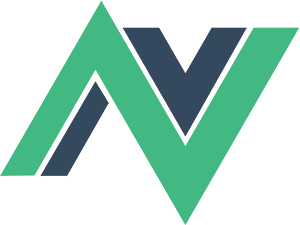

# A New Vue for NativeScript - Webinar Edition

Almost exactly one year ago, [Igor Randjelovic](https://twitter.com/igor_randj) made a now-famous tweet regarding the potential of Vue.js and NativeScript:

<blockquote class="twitter-tweet" data-lang="en">
Managed to use a <a href="https://twitter.com/vuejs?ref_src=twsrc%5Etfw">@vuejs</a> instance to control a <a href="https://twitter.com/NativeScript?ref_src=twsrc%5Etfw">@NativeScript</a> native label! Can&#39;t express how happy I am about a label 😂 <a href="https://t.co/BQUdxNEfEJ">pic.twitter.com/BQUdxNEfEJ</a>
&mdash; Igor Randjelovic (@igor_randj) <a href="https://twitter.com/igor_randj/status/854501034697383936?ref_src=twsrc%5Etfw">April 19, 2017</a></blockquote>

Fast forward to today. The [NativeScript-Vue](https://nativescript-vue.org/) integration has turned 1.0 and we are here to celebrate this new relationship with its own webinar! 🎉

> Join us [Thursday, April 5th at 10AM ET](https://attendee.gotowebinar.com/register/9059771692589680643?source=blog) for the NativeScript-Vue webinar

## Why Vue.js?

Favored by developers who aren't so crazy about the Angular or React approaches to JavaScript development, [Vue.js](https://vuejs.org/) has proven itself as THE alternative to the two mainstays. *Why?* Likely for one of a few reasons:

- Vue feels familiar to those used to working with AngularJS;
- Vue doesn't require a switch to TypeScript;
- Vue is (arguably) easier to get started with than Angular or React.

> "I figured, what if I could just extract the part that I really liked about Angular and build something really lightweight without all the extra concepts involved?" - Vue.js creator, Evan You.

Vue is a *progressive JavaScript framework* and can be adopted incrementally, over time. You don't have to sell out your entire app to Vue, but rather use the bits and pieces that make you a more productive developer. It's a great first-framework for developers moving forward from the jQuery age.

In the case of NativeScript, it's ridiculously easy to translate your web-based Vue knowledge to native mobile:

	const Vue = require("nativescript-vue");
	
	new Vue({
	  methods: {
	    onButtonTap() {
	      console.log("Button was pressed");
	    },
	  },
	
	  template: `
	    <Page class="page">
	      <ActionBar title="Home" class="action-bar" />
	      <StackLayout>
	        <Image src="https://play.nativescript.org/dist/assets/img/NativeScript_logo.png" />
	        <Button text="Button" @tap="onButtonTap" />
	       </StackLayout>
	    </Page>
	  `,
	
	}).$start();

Yep, the code above powers a **truly native mobile app** running on both iOS and Android. Looks awfully similar to your Vue-based web app, no? 😀

> Read more about [getting started with NativeScript-Vue](https://nativescript-vue.org/en/docs/introduction/)

## Webinar Details

Haven't registered for the webinar yet? Now's the time! [Join us on Thursday, April 5th at 10AM ET](https://attendee.gotowebinar.com/register/9059771692589680643?source=blog) as we dive into:

- How you can get started quickly with NativeScript-Vue;
- The value of using Vue.js with NativeScript;
- What you can expect in upcoming NativeScript-Vue releases;
- How you can share a single code base between web and mobile with Vue.js and NativeScript!

Even better, the NativeScript Developer Relations team will be joined by Igor Randjelovic, and we will feature an interview with Vue.js creator, Evan You!

**[Register for the free online webinar today.](https://attendee.gotowebinar.com/register/9059771692589680643?source=blog)** You don't want to be stuck with bad seats for this one! 😉