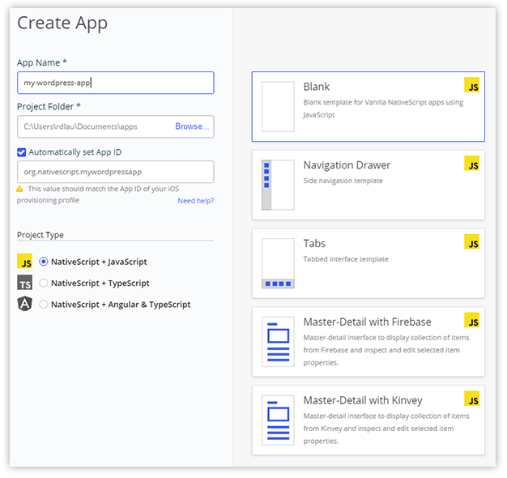

# Using WordPress Content in a Native Mobile App

WordPress is, by far, the most popular content management system (CMS) in the world today. 60% of the CMS market is owned by WordPress, and further, almost 30% of all websites are run on WordPress [[source](https://w3techs.com/technologies/overview/content_management/all)]. This means there is A LOT of content in A LOT of websites that is just dying to be used in new ways, on new devices. Enter NativeScript.

IMAGE of wordpress + {N}?

Ok, WordPress is for managing web content (HTML) and NativeScript is a great framework for building cross-platform native mobile apps (decidedly not HTML). What do the two have in common?

## APIs FTW

As with any great relationship, it all started with a RESTful API.

IMAGE

Out of the box, WordPress includes RESTful API endpoints for WordPress data types, providing web (and now mobile) developers the ability to interact with web content in new and exciting ways. And of course, the provided RESTful API endpoints are language-agnostic. Any language/framework that consumes JSON will happily consume what WordPress provides. Being that NativeScript is built on many web standards, consuming such an API with a simple `fetch` call in JavaScript is as simple as it gets.

## Let's Build an App

I imagine if you are here, you have an existing WordPress site with weeks, months, or even years worth of content. The potential to re-purpose that content with a mobile app is intriguing to say the least.

I think there is no better way to learn something than to do it yourself. So let's build an app!

We are going to put together a simple NativeScript app to leverage WordPress content categories, posts, and post content.

> While a deep dive of the WordPress API is out of the scope of this article, suffice it to say the API is well documented over at wordpress.org.

**Every good NativeScript app starts with NativeScript Sidekick.** This is a free tool for Mac, Windows, and Linux that runs on top of the NativeScript CLI to provide you with starter templates, plugin management, cloud builds, and app store publishing.

With Sidekick open, let's create a new app and choose the **Blank** template:

*I'm going to stick with plain JavaScript, but you're welcome to use TypeScript or Angular if you're more comfortable with those architectures.*

Before we open our code editor of choice, let's add a few pages to our app that we know we will need right now.

Click the **New Page** button and add two more pages, or views, to our app.

Both of the pages can just be **blank** pages, but you can name the first `category` and the second `post`.

## The Code

Our app has three simple views:

- main-page.xml
- category.xml
- post.xml

> Note that a completed version of this app is available here on Github!

Our `main-page` view is just going to be a button. Because who doesn't love a good button?

SCREENSHOT

So our `main-page.xml` file just needs some simple layout code:

CODE

...and the corresponding `main-page.js` file just needs some plumbing to direct us to the `category` view:

CODE

Now it gets interesting. Open up `category.xml` and drop in a NativeScript ListView with an item template like so:

CODE

The code behind JavaScript file, `category.js`, contains two functions. `pageLoaded` is, not surprisingly, executed when the page is loaded, and `showPost` will navigate us to the next view, retaining the context of the category the user tapped:

CODE

Leaving us with a pleasing little ListView:

SCREENSHOT

The key here is the [fetch API](https://developer.mozilla.org/en-US/docs/Web/API/Fetch_API) that we are using in our JavaScript code. `fetch` allows us to request data from a remote endpoint and return it in JSON format. Making it easily digestible in a NativeScript app!

> You'll also notice the API endpoint we are using is leveraging the WordPress demo dataset.

If we take a look at the returned JSON that returns categories, we see a pretty legible dataset:

CODE

Finally, we need to wire up our `post.xml` view with another `ListView`:

CODE

...again, with our `post.js` code behind powering the view and containing another two functions: `pageNavigatedTo` and `loadWebSite` which, perform another `fetch` request to load our posts and fires up a NativeScript WebView to show the post content's HTML output.

CODE

> Reminder, all of this code is available here.....

And we are done! Well, if you run the app as-is, it might not look exactly like these screenshots. That is until you grab the completed app.css file from Github, to save you some time.

Back in Sidekick, go to the **Run** menu and choose **Run on Device**. Choose the device you want to run your app on, and build the app using our cloud servers (or locally if you have the SDKs set up).

> Any troubles? Consult the NativeScript Sidekick docs!

SCREENSHOT

Now sharing website content between platforms is one thing. **What about sharing website code?** While not related to WordPress, if you're an Angular developer and interested in the NativeScript + Angular web/mobile code sharing story, be sure to check out our code sharing webinar on YouTube.

## Summary

Today we looked at how we can consume the WordPress REST API to power a truly native, cross-platform app with NativeScript. By using a little JavaScript and CSS, we can re-purpose years worth of content and provide a new, engaging, user experience for our customers. Happy NativeScripting!

